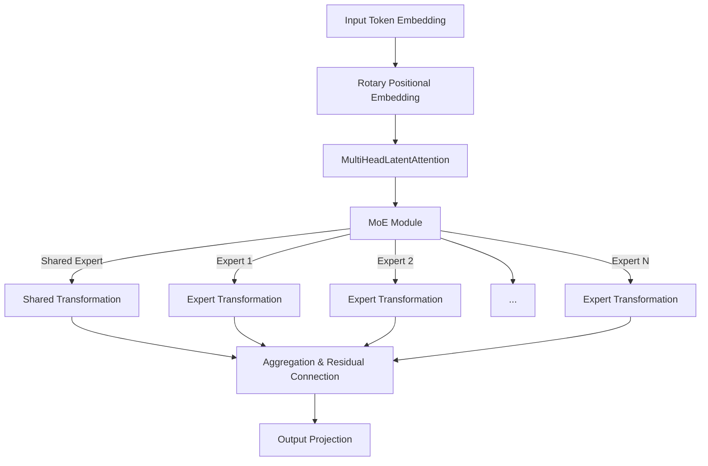

# WordNest Language Model

WordNest is an advanced Transformer-based language model featuring a **Mixture-of-Experts (MoE)** architecture designed for high-quality text generation. It leverages cutting-edge techniques such as **Multi-Head Latent Attention** with **Rotary Positional Embeddings** and a **Multi-Token Prediction (MTP) Module** to maximize context understanding and prediction accuracy. The MoE module dynamically routes tokens to specialized experts, enhancing both performance and model expressiveness.


## Features

- **Multi-Head Latent Attention with Rotary Embeddings**  
  - Implements multi-head attention with rotary positional embeddings to effectively incorporate positional information.
  - See `models/attention.py` and `models/embedding.py`.

- **Mixture-of-Experts (MoE)**  
  - Each layer includes a MoE module composed of a shared expert and multiple specialized experts.
  - Dynamic token routing is performed via a gating mechanism.
  - See `models/moe.py`.

- **Multi-Token Prediction (MTP) Module**  
  - Uses Transformer Encoder layers to enhance prediction over a broader context.
  - See `models/mtp.py`.

- **Custom Tokenizer and Dataset**  
  - A simple tokenizer builds the vocabulary from raw text.
  - The dataset module splits text into fixed-length sequences for training.
  - See `models/tokenizer.py` and `models/dataset.py`.

## Installation

### Requirements
- Python 3.11+
- PyTorch
- Libraries: `numpy`, `einops`

```bash
git clone https://github.com/Polyvor-Labs/WordNest.git
cd WordNest
pip install -r requirements.txt
```

## Usage
### Training the Model
Prepare your dataset in .txt format. Each line in the file should contain one sentence or paragraph.

Configure hyperparameters in the train.py file as needed.

### Generating Text
You can use the trained model to generate text by running the generate.py script:

```bash
python generate.py --prompt "World Scouting" --model_path dist/wordnest_model.pth --vocab_path dist/vocab.pth
```

Example output:

```
World Scouting was founded on July 25, 1907, when Robert Baden-Powell...
```


# MoE Architecture Overview



## Citation
WordNest Language Model

```bibtex
@software{WordNest-Language-Model,
  author = {Zahir Hadi Athallah},
  title = {WordNest: Mixture-of-Experts Language Model with Rotary Embeddings and Multi-Token Prediction},
  year = {2025},
  url = {https://github.com/Polyvor-Labs/WordNest},
  note = {A Transformer-based language model integrating Multi-Head Latent Attention, MoE, and MTP modules for high-quality text generation.}
}
```

## Contributing
Contributions are welcome! If you'd like to contribute, please open an issue or submit a pull request. Make sure to follow the contribution guidelines.

## License
This project is licensed under the Apache License 2.0.